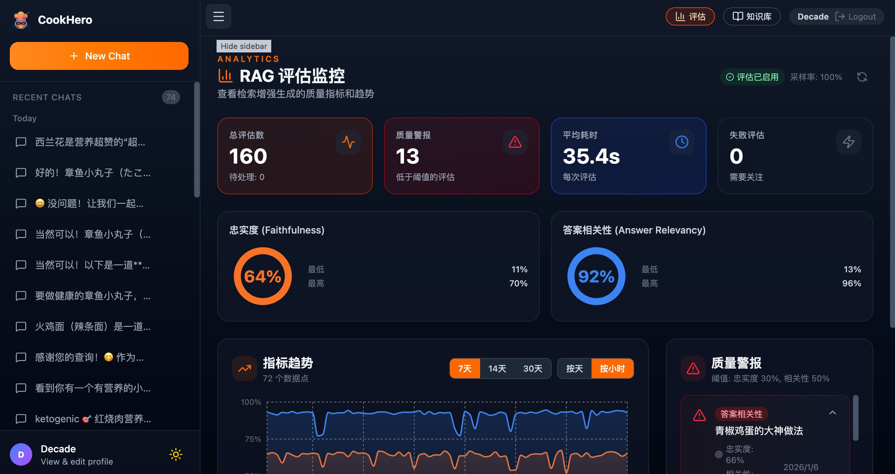

<div align="center">


**Intelligent Cooking Assistant · Make Everyone a Kitchen Hero**

[](https://www.python.org/)
[](https://fastapi.tiangolo.com/)
[](https://www.langchain.com/)
[](https://milvus.io/)
[](https://github.com/NVIDIA/NeMo-Guardrails)
[](https://docs.ragas.io/)
[](LICENSE)

[简体中文](README.md) | English

<div align="center">
<p align="center">
  
  
</p>
</div>


---

## 📖 Project Overview

**CookHero** is an intelligent cooking assistant system based on Large Language Models (LLM) and Retrieval-Augmented Generation (RAG) technology. It's more than just a recipe database—it's your personal kitchen advisor that can:

- 🔍 **Smart Q&A**: Answer questions about cooking techniques, ingredient pairings, nutrition knowledge, and more
- 🍽️ **Personalized Recommendations**: Provide dish suggestions based on user preferences, health goals, and dietary restrictions
- 📝 **Recipe Management**: Upload and manage personal recipes, building a custom knowledge base
- 🧠 **Deep Understanding**: Understand user intent through multi-turn conversations and provide precise suggestions
- 🌐 **Real-time Search**: Integrate web search to obtain the latest cooking information and trends

CookHero targets kitchen beginners, fitness enthusiasts, health-conscious users, people with allergies, and more, aiming to make cooking simple, scientific, and fun.

---

## ✨ Core Features

### 1. Intelligent Conversational Queries
- Natural language understanding of user needs (e.g., "I want to make a low-fat, high-protein dinner")
- Multi-turn conversation support with context history
- Automatic intent recognition (query, recommendation, chat, etc.)

### 2. Hybrid Retrieval System
- **Vector Retrieval**: Semantic similarity matching (based on Milvus)
- **BM25 Retrieval**: Keyword exact matching
- **Metadata Filtering**: Filter by cooking time, difficulty, nutrition, etc.
- **Multi-level Caching**: Redis + Milvus dual-layer caching for improved response speed

### 3. Personalized Settings
- Users can upload personal recipes, which are automatically analyzed and indexed
- Global recipe library (from [HowToCook](https://github.com/Anduin2017/HowToCook)) merged with personal recipes
- Intelligent parsing of Markdown format recipes
- User profiling for preference-based recommendations
- Customizable model response style

### 4. Advanced Reranking
- Use specialized Reranker models for secondary sorting of retrieval results
- Improve result relevance and accuracy

### 5. Web Search Enhancement
- Integrate Tavily search engine to automatically query online when knowledge base is insufficient
- Combine real-time information with local knowledge for comprehensive answers

### 6. User System
- User registration/login (JWT authentication)
- Session management (multi-session isolation, history saving)

### 7. Multimodal Support 🆕
- **Image Recognition**: Upload food/ingredient images for intelligent identification
- **Intent Understanding**: Combine images and text to understand complete user intent
- **Multiple Scenarios**: Dish identification, ingredient recognition, cooking guidance, recipe queries
- **Flexible Integration**: Support for OpenAI-compatible vision model APIs

### 8. RAG Evaluation System 🆕
- **Quality Monitoring**: Automated evaluation based on the RAGAS framework
- **Core Metrics**: Faithfulness, Answer Relevancy
- **Async Evaluation**: Background asynchronous execution without affecting response speed
- **Trend Analysis**: Support for evaluation trend viewing and quality alerts
- **Data Persistence**: Evaluation results stored in PostgreSQL

### 9. Security Protection System 🆕
- **Multi-layer Defense**: Input validation → Pattern detection → LLM deep detection
- **Prompt Injection Protection**: Dual detection mechanism based on rules and AI
- **Rate Limiting**: Redis sliding window algorithm with endpoint-specific limits
- **Account Security**: Login failure lockout, JWT expiration policy, security headers
- **Sensitive Data Protection**: Log sanitization, API key filtering
- **Security Audit**: Structured JSON audit logs, SIEM system integration support

> 📖 For detailed security architecture, see [Security Documentation](SECURITY.md)

---

## 🏗️ Technical Architecture

### RAG Pipeline Flow

1. **Intent Recognition**: Determine query type (recipe search, cooking tips, chat, etc.)
2. **Query Rewriting**: Optimize user input and extract key information
3. **Cache Query**: Check Redis and Milvus cache
4. **Hybrid Retrieval**:
   - Vector retrieval (semantic similarity)
   - BM25 keyword retrieval
   - Metadata filtering (cooking time, difficulty, etc.)
5. **Result Fusion**: Use weighted fusion or RRF (Reciprocal Rank Fusion)
6. **Reranking**: Reranker model for precise ranking
7. **Context Compression**: Extract most relevant segments
8. **LLM Generation**: Generate final answer combining retrieved content
9. **Web Enhancement** (optional): Trigger Tavily search when information is insufficient

---

## 📂 Project Structure

See [Project Structure Documentation](docs/PROJECT_STRUCTURE.md)

---

## 🚀 Quick Start

### Prerequisites

- **Python**: >= 3.12
- **Node.js**: >= 18
- **Docker** and **Docker Compose** (recommended)

### Method 1: Docker One-Click Deployment (Recommended)

1. **Clone the repository**
   ```bash
   git clone https://github.com/Decade-qiu/CookHero.git
   cd CookHero
   ```

2. **Configure environment variables**
   ```bash
   cp .env.example .env
   # Edit .env file and fill in necessary API Keys
   ```

3. **Start infrastructure**
   ```bash
   cd deployments
   docker-compose up -d
   ```
   This will start:
   - PostgreSQL (port 5432)
   - Redis (port 6379)
   - Milvus (port 19530)
   - MinIO (port 9001)
   - Etcd (internal use)

4. **Install Python dependencies and start backend**
   ```bash
   cd ..
   python -m venv .venv
   source .venv/bin/activate  # Windows: .venv\Scripts\activate
   pip install -r requirements.txt
   
   # Initialize database
   python -m scripts.howtocook_loader
   
   # Start backend service
   uvicorn app.main:app --host 0.0.0.0 --port 8000 --reload
   ```

5. **Start frontend**
   ```bash
   cd frontend
   npm install
   npm run dev
   ```

6. **Access the application**
   - Frontend: http://localhost:5173
   - Backend API: http://localhost:8000
   - API Documentation: http://localhost:8000/docs

---

## ⚙️ Configuration

### 1. Environment Variables (`.env`)

Create a `.env` file (refer to `.env.example`):

```env
# LLM API Keys
LLM_API_KEY=your_openai_or_custom_api_key
FAST_LLM_API_KEY=your_fast_model_api_key  # Optional

# Database
DATABASE_PASSWORD=your_postgres_password
REDIS_PASSWORD=your_redis_password  # Optional
MILVUS_USER=root
MILVUS_PASSWORD=your_milvus_password

# Reranker (Optional)
RERANKER_API_KEY=your_reranker_api_key

# Web Search (Optional)
WEB_SEARCH_API_KEY=your_tavily_api_key

# JWT Secret
JWT_SECRET_KEY=your_jwt_secret_key
```

### 2. Main Configuration File (`config.yml`)

Contains:
- LLM provider configuration (fast/normal two-tier models)
- Vector storage configuration
- Retrieval parameters (top_k, score_threshold)
- Reranker configuration
- Caching strategy
- Database connection information

See comments in [config.yml](config.yml) for detailed explanations.

### 3. Security Configuration

| Environment Variable | Default | Description |
|---------------------|---------|-------------|
| `JWT_SECRET_KEY` | **Required** | JWT signing key, must be set in production |
| `ACCESS_TOKEN_EXPIRE_MINUTES` | `60` | Access token expiration time (minutes) |
| `RATE_LIMIT_ENABLED` | `true` | Enable rate limiting |
| `RATE_LIMIT_LOGIN_PER_MINUTE` | `5` | Login endpoint rate limit per minute |
| `RATE_LIMIT_CONVERSATION_PER_MINUTE` | `30` | Conversation endpoint rate limit per minute |
| `LOGIN_MAX_FAILED_ATTEMPTS` | `5` | Failed login attempts before lockout |
| `LOGIN_LOCKOUT_MINUTES` | `15` | Account lockout duration (minutes) |
| `PROMPT_GUARD_ENABLED` | `true` | Enable prompt injection protection |
| `MAX_MESSAGE_LENGTH` | `10000` | Maximum message length (characters) |
| `MAX_IMAGE_SIZE_MB` | `5` | Maximum image size (MB) |

---

## 🛠️ Development Guide

### Backend Development

- **Add new API endpoints**: Create new files in `app/api/v1/endpoints/`
- **Add new services**: Implement business logic in `app/services/`
- **Modify conversation flow**: Adjust conversation management logic in `app/conversation/`
- **Modify RAG pipeline**: Adjust retrieval process in `app/rag/pipeline/`

### Frontend Development

```bash
cd frontend
npm run dev     # Development server
npm run build   # Production build
npm run lint    # Code linting
```

---

## 🗺️ Roadmap

- [x] **Multimodal Support**: Ingredient image recognition, dish identification ✅
- [x] **RAG Evaluation System**: Quality monitoring based on RAGAS ✅
- [x] **Security Protection System**: Input validation, prompt injection protection, rate limiting ✅
- [ ] **Voice Interaction**: Voice input queries, voice step narration
- [ ] **Nutrition Analysis**: Automatic calculation of calories and nutrients
- [ ] **Community Features**: User sharing, ratings, comments
- [ ] **Smart Ingredient Management**: Fridge inventory, expiration reminders
- [ ] **AR Cooking Guidance**: Augmented reality cooking assistance

---

## 🤝 Contributing

Contributions, issues, and feature requests are welcome!

1. Fork the project
2. Create your feature branch (`git checkout -b feature/AmazingFeature`)
3. Commit your changes (`git commit -m 'Add some AmazingFeature'`)
4. Push to the branch (`git push origin feature/AmazingFeature`)
5. Open a Pull Request

---

## 📄 License

This project is licensed under the [APACHE LICENSE 2.0](LICENSE). See the LICENSE file for details.

---

## 🙏 Acknowledgments

- [HowToCook](https://github.com/Anduin2017/HowToCook) - Quality open-source recipe library
- [LangChain](https://www.langchain.com/) - Powerful LLM application framework
- [Milvus](https://milvus.io/) - High-performance vector database
- [FastAPI](https://fastapi.tiangolo.com/) - Modern Python web framework
- [NVIDIA NeMo Guardrails](https://developer.nvidia.com/nvidia-nemo) - Advanced security protection framework

---

<div align="center">

**If this project helps you, please give it a ⭐️ Star!**

</div>
