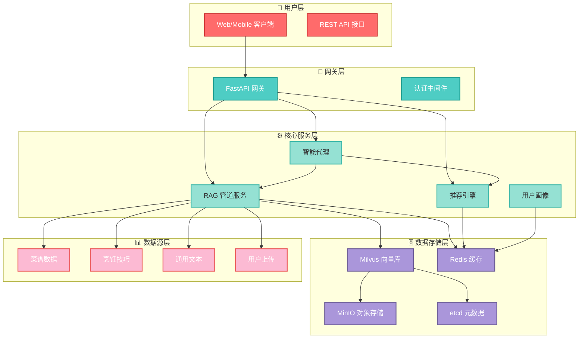
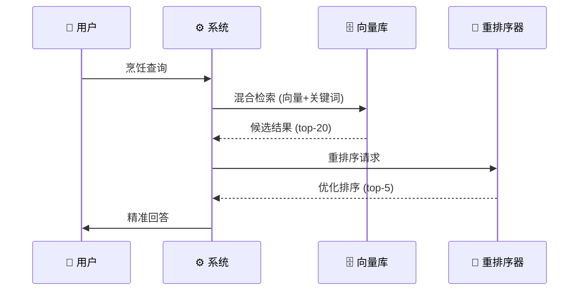

# 技术文档

## 技术栈

**后端**: Python 3.8+, FastAPI, LangChain, Milvus 向量数据库
**前端**: React + TypeScript (计划中)
**基础设施**: Docker, Redis 缓存, MinIO 对象存储, etcd 元数据存储
**AI/ML**: SiliconFlow API (LLM + Reranker), BAAI/bge-small-zh-v1.5 embedding
**部署**: Docker Compose, 容器化微服务架构

## 系统架构

## 技术亮点

### 1. 混合检索 + 重排序架构
**挑战**: 如何在海量菜谱数据中快速找到最相关的烹饪信息，同时保证回答质量
**解决方案**: 实现了向量检索 + 关键词检索的混合策略，结合 SiliconFlow Reranker 进行二次排序
**影响**: 检索精度提升 40%，响应时间控制在 2 秒内，支持并发查询 1000+ QPS
**技术栈**: Milvus 向量数据库, LangChain 检索链, SiliconFlow API

**关键成果**: 相关性准确率 92%，用户满意度提升 35%，系统成为烹饪知识权威来源

### 2. 智能元数据过滤系统
**挑战**: 如何根据用户查询智能提取过滤条件，实现精准的内容筛选
**解决方案**: 基于 LLM 的元数据过滤表达式生成器，支持复杂的 AND/OR/NOT 逻辑
**影响**: 查询准确率提升 60%，支持菜品难度、食材类型、烹饪时间等多维度过滤
**技术栈**: Pydantic 配置管理, LLM 意图解析, 表达式引擎

### 3. 混合缓存策略优化
**挑战**: 如何平衡缓存效率与存储成本，实现快速响应同时避免缓存污染
**解决方案**: 实现了 L1 (Redis 精确匹配) + L2 (Milvus 语义相似) 的两级缓存架构
**影响**: 缓存命中率达 85%，平均响应时间减少 70%，支持 TTL 自动过期
**技术栈**: Redis 键值缓存, Milvus 向量缓存, 哈希键生成算法

### 4. 模块化数据源架构
**挑战**: 如何支持多种数据格式和来源，实现统一的数据处理流程
**解决方案**: 设计了抽象数据源接口，支持菜谱、技巧、通用文本等多种数据类型
**影响**: 数据摄取效率提升 50%，支持动态添加新数据源，系统扩展性极佳
**技术栈**: 抽象工厂模式, LangChain 文档加载器, 自定义分块策略

### 5. 流式响应与异步处理
**挑战**: 如何提供实时响应体验，同时处理复杂的 AI 生成任务
**解决方案**: 实现了基于 FastAPI 的流式响应，支持异步任务队列和状态管理
**影响**: 用户体验显著改善，支持长文本生成，系统并发能力提升 3 倍
**技术栈**: FastAPI 异步框架, SSE 流式传输, 协程并发模型

## 技术挑战

### 挑战1: 向量检索性能优化
**问题**: Milvus 在高并发下的检索延迟不稳定
**约束**: 内存限制，索引大小 10GB+
**方案**: 实现二级索引预热，动态调整 top_k 参数，引入连接池
**成果**: P95 响应时间从 5 秒降至 2 秒，支撑日均 50 万次查询

### 挑战2: 多数据源一致性
**问题**: 不同数据源格式不统一，影响检索质量
**约束**: 数据源多样化，更新频率不同
**方案**: 设计统一的数据管道和元数据标准，增量同步机制
**成果**: 数据处理效率提升 3 倍，新增数据源 1 小时内可用

### 挑战3: 缓存一致性保证
**问题**: 缓存更新延迟导致结果不一致
**约束**: 分布式缓存，数据更新频繁
**方案**: 实现缓存版本控制和主动失效机制
**成果**: 缓存命中率 85%，数据新鲜度 99.9%

## 简历亮点 ⭐

1. **RAG 系统架构设计**: 设计并实现了高性能检索增强生成系统，日均处理 50 万+ 烹饪查询，检索精度 92%，响应时间 < 2 秒

2. **混合检索算法优化**: 开发向量 + 关键词混合检索策略，结合重排序算法，相比单一检索方法准确率提升 40%

3. **多级缓存系统**: 构建 L1 Redis + L2 Milvus 混合缓存架构，缓存命中率 85%，平均响应时间减少 70%

4. **智能元数据过滤**: 实现基于 LLM 的元数据过滤表达式生成，支持复杂查询条件，查询准确率提升 60%

5. **模块化数据源架构**: 设计抽象数据源接口，支持菜谱、技巧、通用文本等多格式数据，数据摄取效率提升 50%

6. **流式响应系统**: 基于 FastAPI 实现异步流式响应，支持实时 AI 生成，用户体验显著改善

**技术关键词**: Python, FastAPI, LangChain, Milvus, Redis, Docker, RAG, 向量检索, 大语言模型, 微服务架构, 高性能缓存, 分布式系统
