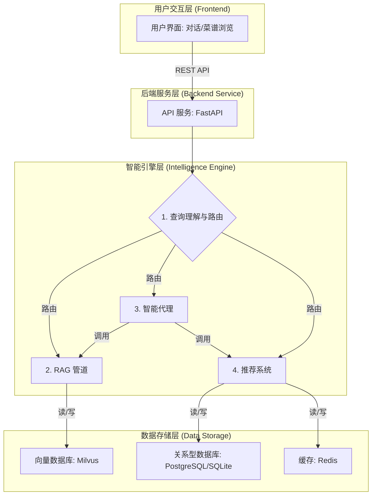
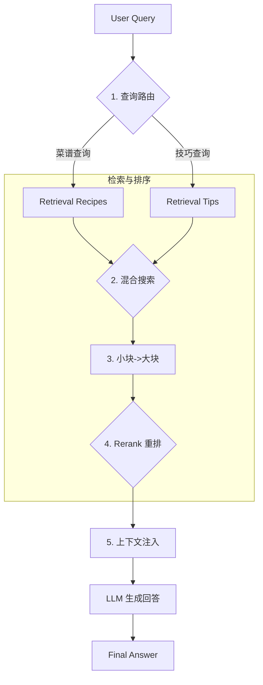

# CookHero: 技术选型与架构设计

## 1. 系统总体架构

CookHero 的总体架构由前端界面层、后端服务层、智能引擎层和数据存储层构成。各层之间通过清晰的接口协作，使系统在保持灵活性的同时具备良好的扩展能力。整体架构围绕 RAG 管道、智能代理、推荐系统和多源数据管理展开，可在后续版本中方便地加入新的模型能力和数据源。

## 2. 核心技术选型

| 技术领域 | 选择方案 | 理由 |
| :--- | :--- | :--- |
| **核心开发语言** | **Python 3.9+** | **AI 与数据科学领域的首选语言**。拥有无与伦比的生态系统，可快速构建、验证和迭代复杂的 AI 应用。 |
| **Web 框架** | **FastAPI** | **高性能的现代 Python Web 框架**。提供自动数据校验、API 文档生成和异步支持，是构建生产级 API 的理想选择。 |
| **LLM 编排** | **LangChain** | **模块化、组件化的 LLM 应用开发框架**。提供了构建 RAG 管道所需的全套工具，简化了开发流程。 |
| **向量数据库** | **Milvus** | **专为 AI 设计的高性能向量数据库**。内置对混合搜索 (Hybrid Search) 的支持，能结合稠密向量（语义）和稀疏向量（关键词），显著提升检索效果。 |
| **配置管理** | **YAML + Pydantic** | **兼具可读性与健壮性**。YAML 提供人类友好的配置格式，Pydantic 则为配置提供严格的类型校验，确保系统稳定性。 |

## 3. RAG 管道设计与实现

RAG (Retrieval-Augmented Generation) 是 CookHero 的核心能力，为菜谱问答、烹饪技巧解释等任务提供可靠的信息基础。

### 3.1. 总体流程

RAG 管道的数据流从解析后的查询开始，经过**查询理解**、**检索**、**重排**和**生成**四个核心阶段。

1.  **查询路由 (Query Routing)**: 使用 LLM 判断用户意图，将请求路由到“菜谱”或“技巧”知识库。
2.  **混合搜索 (Hybrid Search)**: 利用 Milvus 同时进行稠密（语义）和稀疏（关键词）搜索，并根据查询意图动态调整权重。
3.  **Small-to-Large**: 检索精确的文本小块（Child Chunks），然后追溯到完整的父文档（Parent Document），为 LLM 提供更丰富的上下文。
4.  **Rerank 重排**: 使用专用的 Rerank 模型（如 `BAAI/bge-reranker-v2-m3`）对召回的文档进行二次排序，过滤掉与查询不相关的“噪音”文档。
5.  **生成**: 将经过层层筛选的高度相关文档作为上下文，与原始查询一同提交给 LLM 生成最终答案。

### 3.2. 索引策略 (Indexing Strategy)

为提升检索效果，系统在数据入库时采用了多种索引策略：

- **混合索引 (Hybrid Indexing)**: 同时创建稠密向量索引（用于语义相似度）和稀疏向量索引（用于关键词匹配）。
- **结构化索引**: 为文档附加结构化的元数据（如菜品类别、难度、烹饪时间），允许在检索时进行精确过滤。
- **确定性 ID**: 基于文件路径生成唯一的、确定性的文档 ID，确保了在多次数据入库或不同服务实例之间，子块到父文档的映射关系始终一致。

### 3.3. 未来规划：Correction RAG

为了进一步提升系统的鲁棒性，未来计划引入 **Correction RAG** 的思路：

1.  **检索评估**: 引入一个“检索评估器”（Retrieval Evaluator），使用 LLM 判断初步检索到的每个文档与查询的相关性，并打上“正确”、“不正确”或“模糊”的标签。
2.  **知识精炼**: 对于“正确”的文档，进入知识精炼（Knowledge Refinement）模块，结合多个相关文档生成最终答案。
3.  **知识搜索 (Web Search)**: 对于“不正确”或“模糊”的文档，触发“知识搜索”。系统将对原始查询进行重写，然后调用外部搜索引擎（如 Google Search）来获取缺失或不明确的信息，用以补充或修正回答。

## 4. 智能代理系统设计 (规划中)

智能代理是 CookHero 实现复杂、多步骤任务的核心。它负责跨模块调度和任务分解，使系统能够完成多目标、跨模块的智能操作。

- **核心能力**:
    - **任务分解**: 将用户的复合查询（如“帮我制定一周高蛋白低脂计划并生成购物清单”）拆解为多个子任务。
    - **工具调用**: 根据任务需求调用 RAG 管道、推荐模块或外部 API。
    - **结果整合**: 将不同子模块返回的结果进行融合、推理，生成完整响应。
- **实现方式**: 计划基于 `LangChain Agents` 构建，利用其工具调用、任务规划和自我反思能力。

## 5. 推荐系统设计 (规划中)

推荐系统是 CookHero 提供个性化菜品和饮食计划的核心模块。

- **数据来源**:
    - 内置与用户上传的菜谱。
    - 食堂与外卖平台的实时菜单。
    - 用户画像（历史行为、口味偏好、健康目标、饮食限制）。
- **推荐策略**:
    - **硬过滤**: 基于用户的过敏信息和忌口进行严格筛选。
    - **相似度推荐**: 基于菜品特征 embedding 计算相似度，推荐相似菜品。
    - **协同过滤**: 结合用户历史行为和相似用户的偏好进行推荐。
    - **健康目标匹配**: 根据用户的减脂、增肌等目标生成饮食计划。